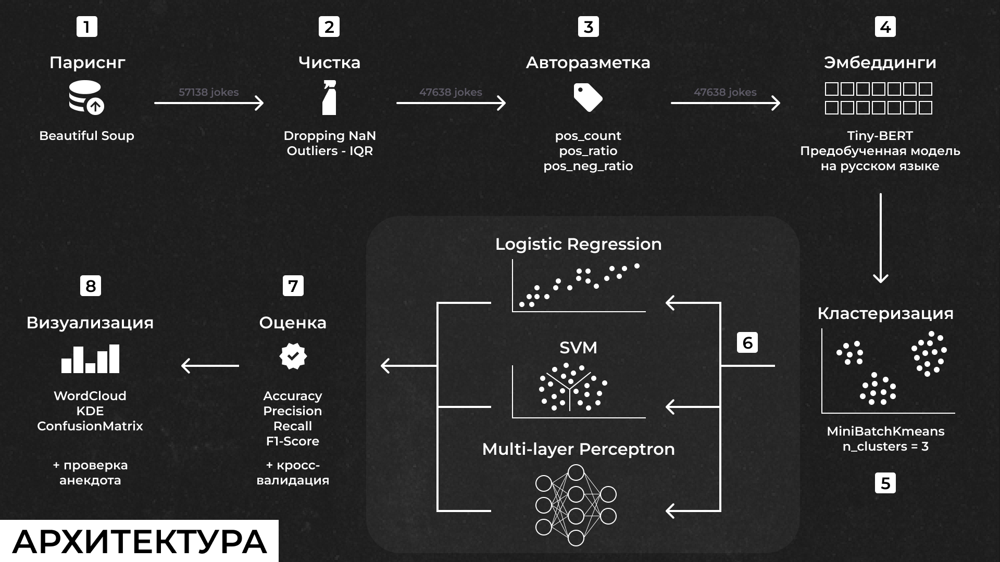
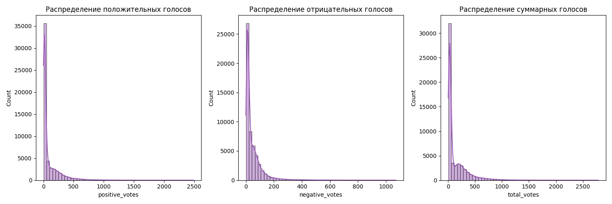
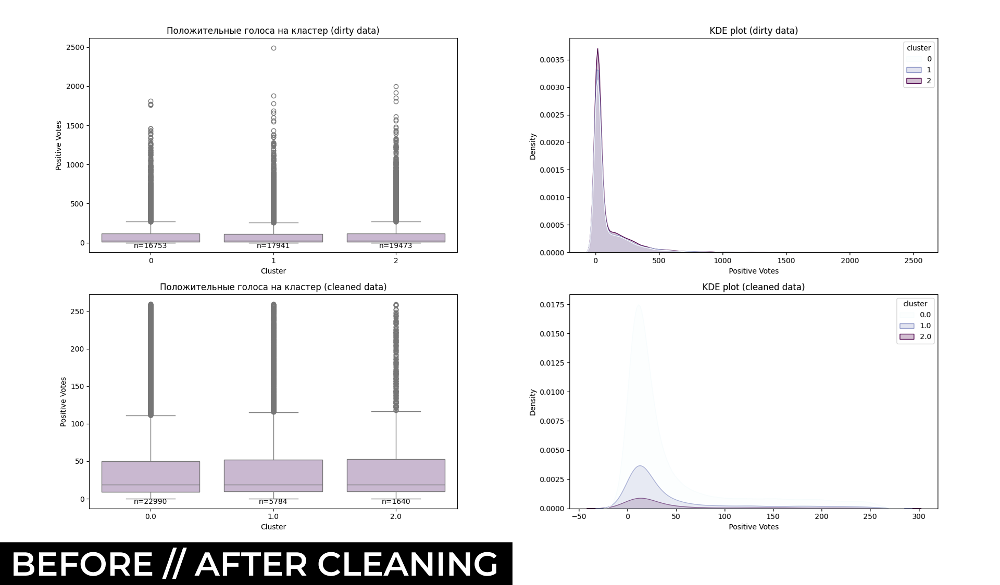
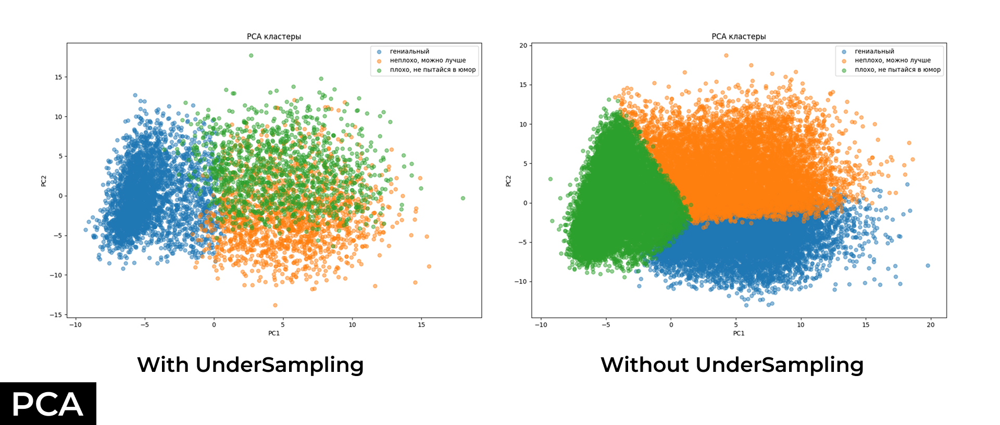
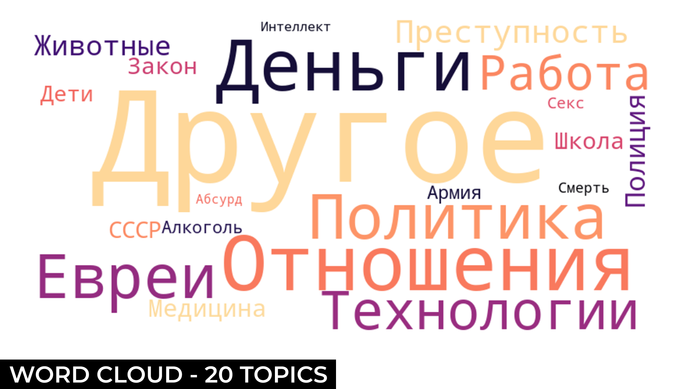
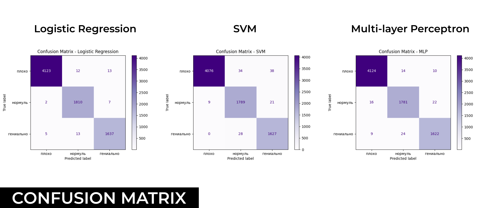
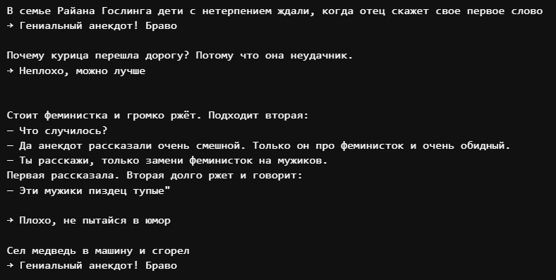

# RussianJokesClassifier

Проект по сбору, обработке и анализу русскоязычных анекдотов с сайта anekdot.ru с целью автоматической классификации их качества. В рамках проекта реализованы парсинг, очистка данных, их кластеризация, обучение трех разных моделей и визуализация результатов.


## Описание проекта

Для начала с сайта anekdot.ru было собрано около 57 000 русских анекдотов за 2023-2024 годы с оценками от пользователей (положительные, отрицательные, суммарные). Парсинг проводился с помощью python библиотеки Beautiful Soup. 

Далее данные очищались от пустых значений (анекдотов-картинок) и чистились выборы (межквартильный размах по положительным отзывам). После предобработки число анекдотов сократилось до \~47 000.

Была проведена автоматическая разметка по 3 классам (хороший анекдот, нормальный и плохой). Она проводилась:

- По кол-ву положительных голосов
- Отношению положительных голосов к суммарным
- Отношению положительных голосов к отрицательным

На размеченных данных были построены эмбеддинги (rubert-tiny), на основе которых обучались модели. Балансировка проходила после построения эмбеддингов, чтобы избежать утери соотношения размеченных классов анекдотов. А затем обучение моделей


## Архитектура



## Структура репозитория

```
RussianJokesClassifier/
├── old_data/
│   ├── joke_data_2024.csv            # ранее собранные анеки за 24 год
│   ├── sample_labeling.csv           # пробник разметки
├── new_data/
│   ├── joke_data_multi_year.csv      # анеки за 22-24 года
│   ├── joke_data_multi_year_cleaned.csv 
│   ├── joke_data_autolabeled.csv 
├── figures/
│   ├── architecture.png              # схема архитектуры
│   ├── BoxPlot_KDE_before_after_cleaning.png
│   ├── Confusion_matrix_all.png
│   ├── Topic_word_cloud.png
│   ├── Total_voice_distribution.png
│   ├── Confusion_matrix_Logistic_Regression.png
│   ├── Confusion_matrix_SVM.png
│   ├── Confusion_matrix_MLP.png
│   ├── PCA_all.png
│   ├── PCA_balanced.png
│   ├── PCA_wo_balanced.png
│   ├── Voices_distribution_before_cleaning.png
│   ├── test.jpg
├── code.ipynb                        # тетрадь
├── README.md                        
```


## Используемые модели

- Эмбеддинги: `cointegrated/rubert-tiny` (TinyBERT)
- Кластеризация: `MiniBatchKMeans`
- Классификация:
  - Logistic Regression (лучший по F1-score)
  - Support Vector Machine (SVM)
  - Multi-layer Perceptron (MLP)


## Визуализация + инсайты

Для начала было оценено распределение голосов в сырых данных. Распределены они ненормально. Число анекдотов как с положительной, так и с отрицательной оценкой с их ростом падает.



На иллюстрации ниже показано, как различались распределения оценок перед и после чистки. Без обработки было много выбросов и большое количество шума на KDE графиках, после же было заметно четкое разделение классов.



После чистки было проведено сравнение графиков главных компонент с разделенными классами анеков с балансировкой (UnderSampling) и без нее. С балансировкой терялось распределенние выделенных классов, модели считали, что всего поровну. Поэтому в проекте данные балансировались на этапе обучения моделей.



Было интересно посмотреть, на какие темы были собраны анекдоты. Для этого использовался достаточно примитивный, однако в данном случае показательный метод разделения топиков вручную и построение по ним WordCloud. 



Модели показали итого высокое качество, которое было подтверждено кросс-валидацией. Можно посмотреть на матрицы ошибок ниже:



## Запуск классификации

В тетради `code.ipynb` есть функция:

```python
predict_cluster_for_joke("Три еврея зашли в бар...", tokenizer, model, scaler, best_model)
```

## Результаты классификации
Ниже я прогнала парочку анеков и в целом с уверенность могу сказать, что на 90% согласна с выводами классификатора:)


